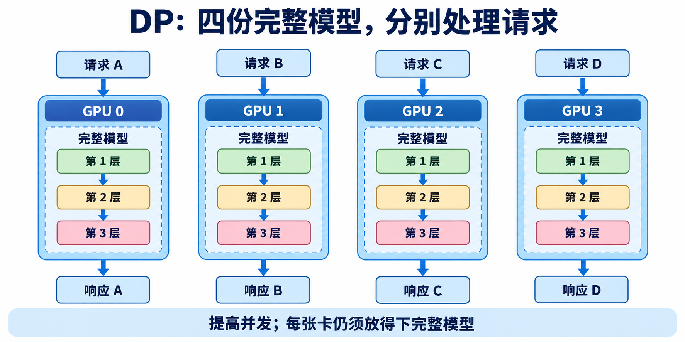
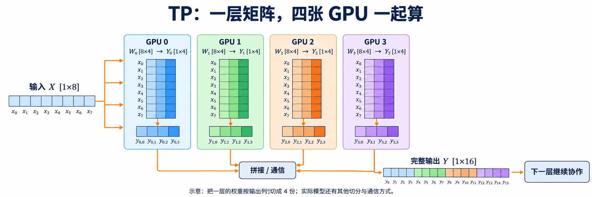
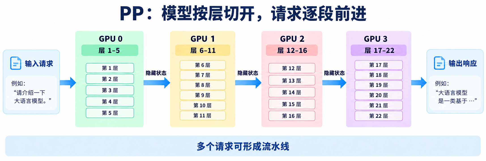
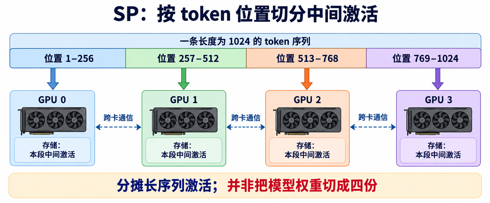
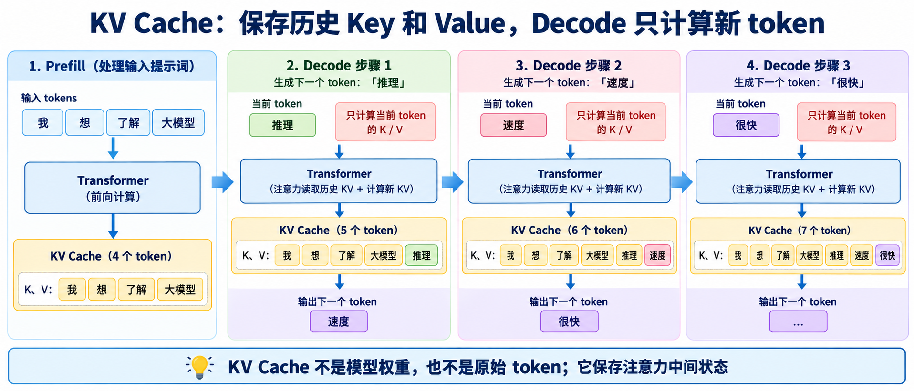
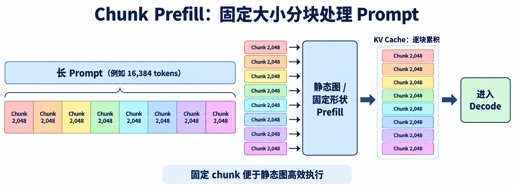

# FAE 培训讲稿：讲清投机解码、模型并行与量化

**建议时长：40 分钟。** 目标是让听众能解释四种投机解码技术、四种常见并行方式、Chunk Prefill，以及量化、GPTQ、AWQ 的基本做法和部署边界。无需深入模型层结构或量化内核实现。

## 1. 先讲共同问题：为什么生成会慢？（2 分钟）

大模型生成文本通常是逐 token 进行的。生成下一个 token，要等上一个 token 确定；输出很长时，这种串行等待会累积。Agent、代码生成、长推理尤其容易遇到这个问题。

**投机解码**的想法是：让一个更轻的草稿模块先猜后面几个 token，再让主模型一次检查一整段。主模型只接受从开头起连续猜对的部分；猜错处以及后面的猜测都不采用。主模型仍掌握最终输出。

```text
普通生成：主模型出 1 个 → 主模型出 1 个 → 主模型出 1 个 → ……
投机解码：草稿先猜一段 ──────────────→ 主模型一次验证这一段
```

下面的数字**只用于说明原理**。假设主模型逐 token 计算一次要 10 毫秒；草稿猜出 4 个候选要 4 毫秒；主模型一次验证这 4 个候选要 15 毫秒：

```text
普通生成 4 个： [主模型 10 ms] → [主模型 10 ms] → [主模型 10 ms] → [主模型 10 ms]
                 总计 40 ms                 ↑ 每一步都要等上一步的结果

草稿全部猜对： [草稿提出 4 个：4 ms] → [主模型一次验证 4 个：15 ms]
                 总计 19 ms                 ↑ 已知候选可以一起送入主模型

草稿很早猜错： 同样花了约 19 ms，却只接受了很短的前缀，可能得不偿失
```

把全对时的时间写成算式，就是 `4 × 10 ms = 40 ms` 对比 `4 ms + 15 ms = 19 ms`。验证仍需计算 4 个位置，但这些候选已经给定，可以在一次主模型调用中并行处理；权重读取和调用开销由多个位置分摊，所以耗时不一定变成 `4 × 10 ms`。实际收益仍取决于草稿命中率、硬件和并发情况，上面的数字不是性能承诺。

**为什么序列长度变成 4，验证耗时却没有等比例增加？**以主模型某层的线性计算为例，逐 token decode 要分 4 次用同一张权重矩阵，每次只处理 1 行输入；整块验证则把 4 行输入合在一次矩阵乘法里，GPU 读取这张权重后就能服务 4 行，并让多个计算单元同时工作。乘法运算增加了，但权重读取与固定调用开销不必重复 4 次，所以延迟可能只从 10 毫秒增到 15 毫秒。上下文很长或并发较高时，实际耗时关系可能不同。

可以把它比作“先写答案，再让老师批改”：老师一次看几题；只要中途一道错了，后面依赖它的答案就暂时不能算数。**草稿负责提议，主模型负责确认。**正确实现的贪心验证保持主模型原本的贪心输出；采样场景需要相应的接受与拒绝规则来保持目标分布。

## 2. MTP：让小模块接力往后猜（3 分钟）

MTP（Multi-Token Prediction，多 token 预测）既是一种**训练目标**，也能在推理时提供草稿。先把这两种“加速”分开讲：

**训练阶段：提高学习效率**。传统训练主要让模型在每个位置预测下一个 token；MTP 还要求它预测更远的后续 token。例如看到“今天天气”后，除了学习下一个词，也要学习再后面的词。多个未来位置提供更丰富的监督信号，促使模型学到跨越多步的上下文关系。在一些实验中，这能让模型在相近的数据或训练预算下取得更好的能力，或者用更少资源达到相近效果。这里的“训练加速”指**达到目标效果的效率可能提高**，不表示每一步训练的耗时都会缩短；额外预测头也会带来计算。

**推理阶段：减少主模型的串行轮数**。主模型先给 MTP 小模块两样东西：**当前 token 的 ID**，以及主模型读到前一个位置时产生的**最后一层隐藏状态**。隐藏状态可以理解成主模型对已读内容形成的内部表示；MTP 把它和 token 信息结合，猜出下一个 token，再用新猜出的 token 和 MTP 上一步的隐藏状态接着往后猜。**这里草稿的预测是串行的**：第 2 个草稿 token 要等第 1 个确定，第 3 个又要等第 2 个确定，不能用一次 MTP 前向同时得到整段。主模型随后一次验证整段。它仍可能加速，因为每一步运行的是比主模型轻得多的小模块；若连续猜对多个 token，就能用几次轻量草稿计算加一次整段验证，替代主模型的多次逐 token 调用。这说的是推理时的草稿生成顺序，与训练时对多个未来位置施加预测目标是两件事。

给客户讲时可以说：“训练时，MTP 让模型在每个位置多学几步；推理时，让较轻的模块先写几步，主模型统一审核。前者可能提高训练效率，后者可能降低生成延迟。”

## 3. DFlash：草稿一次猜一整块（3 分钟）

DFlash 仍遵守“草稿提议、主模型验证”，改动集中在**草稿怎么产生**。可以用一轮生成来讲：

1. **主模型先读完已有内容。** 它给出下一个 token `t0`，同时交出已读内容在**若干指定层、每个位置的隐藏状态**。DFlash 把这些中间表示当作上下文，供整块草稿一起参考。相比 MTP 主要接收当前 token 和前一位置的最后一层表示，DFlash 会利用主模型多个层、整段已确认内容的表示。
2. **草稿模型一次猜一块。** 把 `t0` 放在开头，后面摆几个待填的 `MASK` 位置，例如 `[t0, MASK, MASK, MASK]`。草稿模型一次前向就为 3 个空位给出候选 `d1、d2、d3`；这些位置不需要像 MTP 那样等前一位先猜完再运行下一次草稿前向。
3. **主模型一次验收。** 它读入 `[t0,d1,d2,d3]`，从左到右检查。如果 `d1、d2` 对而 `d3` 错，就只留下连续正确的 `[t0,d1,d2]`，并用主模型给出的正确下一 token 继续下一轮。

这里有两份不同的缓存：**主模型 cache** 保存主模型已经处理过的历史，供主模型后续生成和验证；**草稿模型 cache** 由主模型交出的隐藏状态建立，保存草稿模型所需的上下文。DFlash 不会把主模型 cache 直接作为草稿模型的输入。每轮验证结束后，也只把主模型确认的前缀信息交给草稿模型继续使用。

**优势在哪里？** 草稿网络只跑一次就提出多个 token，减少了“草稿也要串行等很多步”的开销。如果主模型能连续接受多个候选，一次验证就推进多个 token。**限制在哪里？** 各位置并行猜测时，可能各自都选了看起来不错的词，拼起来却重复或不连贯；一旦前面某位错了，后面的候选这轮就用不上。

给客户讲时可以说：“DFlash 让助理一次把整段草稿写出来，写得快；但各句之间未必衔接好。”

## 4. DFlash2：让整块草稿更容易通过审核（3 分钟）

DFlash2 沿用这两份独立缓存：草稿模型读取主模型的隐藏状态，建立自己的上下文 cache，**同样不直接读取主模型 cache**。它保留 DFlash 的**一次并行计算整块**，但不急着把每个位置分数最高的词直接拼起来，而是在同一轮里多做两件事：

1. **让后面的词更容易接上前面的词。** DFlash2 加了一个很小的计算模块，让每个位置参考左边紧挨着的位置。这样，整段草稿越往后也不容易猜偏。所有位置仍能一起计算，草稿模型只需运行一次。
2. **再从候选里选一条连贯路径。** 每个位置保留一小组候选词。第一个位置参考主模型给出的 `t0` 选 `d1`；第二个位置参考刚选出的 `d1` 选 `d2`，依次往后。这样，当某个位置的正确词排在第二或第三、但比第一名更接得上前文时，还有机会把它选出来。这里确实有从左到右的顺序，但只是在少量候选之间打分，**不需要每选一个词就重新运行草稿网络**。

选好 `[d1,d2,d3]` 后，**主模型的验收方式与 DFlash 一样**：一次验证整块，只接受连续正确的前缀。DFlash2 一方面让相邻的词接得更顺，另一方面让后半段的猜测更靠谱，因此主模型一次有机会接受更多 token。新增的计算也要花时间，所以是否更快仍要看端到端测试。

给客户讲时可以说：“DFlash2 让助理继续一次写整段，但写完会在候选词里挑更顺的组合，同时照顾段落后半部分的质量。”

## 5. DSpark：猜完一块后，决定怎么选、送多少（3 分钟）

**DSpark 是 DFlash 的延续；DFlash2 是从 DFlash 出发的另一条改进路线。** DSpark 保留“一次算出整块草稿”的主干，在草稿选词和主模型验证之前各加一道轻量判断。

还是用主模型已给出 `t0`、草稿准备猜 `d1～d7` 来讲：

1. **先算整块。** 草稿模型读取主模型已确认内容的隐藏状态，建立自己的上下文 cache；再对 `[t0, MASK, ...]` 做一次前向，得到 7 个位置的表示。它不直接拿主模型的 cache 来用。
2. **选词时考虑前一个词。** DSpark 的 Markov head 给当前位置的候选词调整分数：选 `d1` 时参考 `t0`，选 `d2` 时参考刚选出的 `d1`，以此类推。选词有从左到右的依赖，但不需要把草稿网络重新运行 7 次。相比 DFlash2 在每个位置的少量候选里选路径，DSpark 的这一步会调整整个词表的分数。
3. **送验证前看信心。** confidence head 估计每个候选通过主模型验证的希望。如果第 4 个位置的分数首先低于阈值，就停在 `d3`，只把 `[t0,d1,d2,d3]` 送去主模型验证；第 4 个位置的候选不保留，`d5～d7` 不再选词，也不进入这次主模型验证。

这里有个常见疑问：**如果没有提前截短，而是把 `d1～d7` 全送给主模型，主模型验到 `d4` 错了，会不会立刻停算？** 不会。主模型一次前向已经计算了整段，然后才从左到右决定接受到哪里。此时 `d5～d7` 的验证计算已经发生，但结果不能使用。confidence head 的价值就在于**送验证之前**尽量避开这种低价值的后缀。它无法省掉已经完成的草稿主干计算；在上述例子中，还能省去 `d4～d7` 后续的轻量选词工作。

confidence 只是草稿模型的估计，并不替代主模型验收。阈值设得太高也可能把本来猜对的后缀提前截掉，所以仍需实测端到端速度。

给客户讲时可以说：“DSpark 让助理一次写出整段的备选思路，再逐词挑出衔接更顺的答案；如果后半段自己都没把握，就少交几句给主模型审核。”

## 6. 四者放在一起看（2 分钟）

| 技术 | 草稿怎样产生 | 主要解决什么 | 需要记住的边界 |
| --- | --- | --- | --- |
| MTP | 小模块逐步接力预测 | 训练时增加未来位置的监督；推理时用较轻的草稿计算换取更少的主模型串行轮数 | 训练单步不保证更快；推理草稿仍有逐步依赖 |
| DFlash | 一次并行预测一块 | 减少草稿阶段的串行等待 | 各位置的预测可能不连贯，并行预测 |
| DFlash2 | 一次并行预测一块，再挑选连贯候选 | 提高整块特别是后半段的可接受程度 | 选择器和卷积增加少量工作，并行预测 |
| DSpark | 一次并行算一块，再逐位置修正选词；按信心决定验证长度 | 让已选词影响后面的选择，减少低信心后缀的验证计算 | confidence 可能过早截短；草稿主干仍算完整块 |

**讲述顺序可以记成：MTP 训练时多学几步、推理时接力猜多步 → DFlash 并行猜一块 → DFlash2 改善候选衔接与块尾质量；DSpark 则改善选词并按信心缩短验证块。** DFlash2 和 DSpark 是 DFlash 之后的两条路线。推理阶段四者都需要主模型验证；MTP 还可以作为训练目标使用。

## 7. 模型并行方式：四张 GPU 怎么分工？（7 分钟）

前面的投机解码在想办法**减少主模型逐 token 串行运行的次数**。这里换一个问题：模型太大，一张卡放不下；或者请求太多，一张卡忙不过来，怎么用多张 GPU？常见的缩写是 DP、TP、PP、SP。它们与投机解码可以组合，但解决的是不同环节的问题。

下面都以四张 GPU 为例，分别看各卡放的是完整模型、模型的一部分，还是一段序列的中间数据。

### DP：一张卡一份完整模型，各接各的请求

**解决的问题：模型单卡放得下，但同时来的请求太多，一份模型处理不过来。** DP 用多份模型副本分担请求，重点提高并发吞吐。

DP（Data Parallel，数据并行）在推理服务中可以理解成**复制模型、分发请求**。四张卡各放一份完整模型：请求 A 去 GPU 0，请求 B 去 GPU 1，各自独立生成。训练时则是各卡处理不同数据，再同步梯度。



它的优势是容易增加**同时服务的请求数**。但 DP 没有把模型切小。比如模型权重就要 40 GB，而每张卡只有 24 GB，四卡 DP 仍然放不下任何一份完整模型。对一个请求来说，也不能因为用了四卡 DP 就期待单请求延迟变成四分之一。

给客户讲时可以说：“DP 像开四家相同的店，一家满了可以去另一家；但每家都得装得下完整的一套设备。”

### TP：同一层拆给多张卡一起算（后摩支持，多卡编译）

**解决的问题：单张卡放不下模型的参数，或单卡完成一层计算的压力太大。** TP 让多张卡一起保存并计算同一层。

TP（Tensor Parallel，张量并行）切的是**同一层里的权重和计算**。先用图中的一层线性计算举例：一个 token 的输入是 `X[1×8]`，完整权重是 `W[8×16]`，相乘后应得到 `Y[1×16]`。这里的 8 和 16 只是为了把切分画清楚，不是实际大模型的维度。



如果按权重的**输出列**切成四份，每张卡只保存自己的 `Wᵢ[8×4]`。同一个输入 `X` 发给四张卡后，GPU 0 算 `X × W₀ = Y₀[1×4]`，GPU 1 算 `Y₁[1×4]`，另外两张卡也各算四个输出值。把 `Y₀、Y₁、Y₂、Y₃` 按顺序拼在一起，逻辑上就是完整的 `Y[1×16]`：

```text
完整计算：X[1×8] × W[8×16] = Y[1×16]
四卡切分：X × W₀ → Y₀[1×4]  ┐
          X × W₁ → Y₁[1×4]  ├→ 拼接 → Y[1×16]
          X × W₂ → Y₂[1×4]  │
          X × W₃ → Y₃[1×4]  ┘
```

这说明了两件事：**权重不用每卡都放完整的一份；一个请求的一层计算由四张卡同时承担。** 下一层也可以继续由这四张卡协作。图中的“拼接”表示结果需要在逻辑上成为完整输出；真实 Transformer 会组合不同的列切分和行切分，有些中间结果可以保持分片，不一定每层都先拼出完整张量。

它能把单卡放不下的参数分摊出去，也可能缩短一层的大计算时间。代价是**层内要反复跨卡通信**：输入要让参与计算的卡拿到，需要合并的结果也要交换。模型层数很多，卡间连接慢时，通信可能吃掉计算收益。实际显存还包含 KV cache 和运行时缓冲，不能只用“模型大小除以四”来估算。

给客户讲时可以说：“TP 是四个人同时做同一道大菜，每人负责一部分；每做完一步都得把结果对起来。”

### PP：按模型层分段，前后接力（后摩支持）

**解决的问题：完整模型放不进一张卡，但把前后层分开放就能装下；多个请求还可以在不同阶段同时推进。** PP 把模型层分段交给不同的卡。

PP（Pipeline Parallel，流水线并行）切的是**模型的层**。假设模型有 22 层，可以示意为 GPU 0 跑前 5 层，GPU 1 跑接下来的 6 层，GPU 2 再跑 5 层，GPU 3 跑最后 6 层。一个请求要按顺序经过四张卡；前一张卡把中间隐藏状态传给下一张卡。



它让各卡只保存自己那段层的权重，适合按层拆开才能放下的模型。边界也很直观：**单个请求仍要走完所有阶段**，不能把四段耗时当成同时完成；请求少时，后面的卡可能在等前面的卡。多个请求或多个批次进入流水线后，各阶段才更容易同时忙起来，吞吐收益也更明显。

给客户讲时可以说：“PP 像工厂流水线，第一站做前几步，第二站接着做；同时有多件产品在流水线上，设备才更容易用满。”

### SP：沿 token 序列分摊中间数据

**解决的问题：输入序列很长，中间激活随 token 数增加，单卡的激活显存压力变大。** SP 把不同 token 位置上的中间数据分给多张卡。

SP（Sequence Parallel，序列并行）切的是**序列维度上的中间激活**。例如一段输入有 1024 个 token，四张卡可以各负责约 256 个位置的部分中间计算与保存。长输入时，序列越长，中间激活越占显存，SP 就有机会分摊这部分开销。它常与 TP 等方式配合使用。



这里不能理解成“把文章切成四段，各卡完全独立阅读”。注意力会让后面的位置参考前面的内容，因此一些计算步骤仍需跨卡交换信息。**SP 主要帮助分摊长序列的中间状态，不会单靠自己把模型权重切成四份**；是否加速还要看具体实现和通信成本。

给客户讲时可以说：“SP 是把一篇长文章分段交给四个人做笔记；要理解前后文时，他们仍得交换笔记。”

四种方式放在一起，记住一句话：**DP 复制模型分请求，TP 切同一层，PP 切前后层，SP 切序列位置上的中间数据。** 如果客户问“哪种最好”，先问目标：是模型放不下、长序列占显存、单请求延迟高，还是并发请求太多？四张卡也不自动等于四倍速度，最终仍要看显存、通信、延迟和吞吐的实测结果。

| 方式 | 切分对象 | 最直接的收益 | 最需要留意的事 |
| --- | --- | --- | --- |
| DP | 请求/数据，模型每卡一份 | 增加并发吞吐 | 单卡仍要放得下完整模型 |
| TP | 每层的权重与计算 | 分摊单层参数和计算 | 层内频繁通信 |
| PP（后摩支持） | 前后模型层 | 分摊整模型权重 | 请求依次经过各阶段，负载低时有等待 |
| SP | token 位置上的中间激活 | 分摊长序列激活 | 跨位置计算仍需通信，不直接切小权重 |

## 8. 量化：用更少的位数保存和计算（10 分钟）

量化主要解决**模型权重占用显存太多、显存带宽压力大，导致模型放不下或推理成本高**的问题。它把原本用 FP16、BF16 等格式表示的数值，转换成更低位数的表示，例如 8 bit 或 4 bit。位数变少后，权重文件和推理时的权重占用通常会下降；实际能否提速，则要看设备和推理框架是否有合适的低比特计算内核。

先区分两件经常混在一起的事：**W4A16** 表示权重用 4 bit 存储、激活仍用 16 bit 计算；**W8A8** 表示权重和激活都用 8 bit。GPTQ、AWQ 在常见部署中主要用于权重量化，常见组合是低比特权重加 FP16/BF16 激活。它们不会自动把 KV cache 也变成低比特；KV cache 通常要另行配置量化。

### 量化通用实现：从浮点权重到可推理模型

给客户讲可以按下面四步走：

1. **准备原始模型和校准文本。** 校准文本不需要拿来训练模型，主要让模型跑一些有代表性的输入，观察不同层和通道上的数值分布。校准内容越接近真实业务，量化参数通常越有参考价值。
2. **确定量化设置。** 例如量化到 8 bit 还是 4 bit、只量化权重还是也量化激活、按整层还是按小组（group）计算缩放比例，以及使用对称还是非对称表示。
3. **计算缩放参数并压缩权重。** 量化器将浮点权重映射到有限的整数等级，同时保存 scale、zero point 等少量元数据。推理时由对应的 kernel 直接使用低比特权重计算，或在需要时把数值还原到计算精度。
4. **验证质量和速度。** 检查模型输出质量、任务指标、显存峰值、prefill 和 decode 速度。权重文件变小只证明存储变小，不代表推理一定变快。

用一个简单的线性量化来理解映射：

```text
浮点权重 w  ──按 scale / zero point 映射──→ 低比特整数 q
推理时：q 与输入参与低比特 kernel 计算，或按 scale 还原后计算
```

对称量化通常围绕 0 对称编码；非对称量化还能表示偏离 0 的范围。按组量化会为一小组权重保存一套缩放参数，比整层共用一套 scale 更能适应数值差异，但会增加少量元数据和计算处理。量化位数越低，压缩越明显，舍入误差通常也越难控制。

可以用一个粗略估算帮助判断权重能否装下：若有 70 亿个参数，理想情况下 FP16 权重约占 `7B × 2 bytes ≈ 14 GB`，4 bit 权重约占 `7B × 0.5 byte ≈ 3.5 GB`。实际还要加上量化元数据、未量化模块、KV cache、临时激活和运行时开销，所以不能把 3.5 GB 当作整模型推理显存。

### GPTQ：根据校准输入逐层补偿量化误差

GPTQ 是一种**训练后权重量化**方法。它用少量校准输入统计模型内部的输入特征，再逐层量化权重。关键思路是：某个权重被舍入后产生误差时，利用近似二阶信息估计哪些相关权重可以做小幅调整，尽量补偿这次误差，让该层输出更接近量化前的结果。

通俗地说，普通量化像是把每个数字各自四舍五入；GPTQ 会考虑这些数字在模型计算中的影响，量化一部分权重后，再调整尚未处理的相关权重，减少输出偏差。它不是重新训练整个模型，也不需要反向传播完整训练集。

GPTQ 部署时通常会看到 `bits`、`group_size`、`desc_act` 等配置：位数决定权重表示范围，group size 决定每组共享缩放参数的权重数量，activation order 等选项影响量化顺序和精度/速度取舍。客户侧不必先背参数名，先确认模型文件的量化配置与推理后端、GPU kernel 相匹配。

### AWQ：看激活分布，保护更重要的通道

AWQ（Activation-aware Weight Quantization）同样是训练后权重量化，但它的观察重点是：**权重大小不等于权重对输出的重要程度**。某些通道的激活更常出现或幅度更大，这些通道对应的权重误差可能更影响模型输出。

AWQ 用校准输入统计激活分布，找出较重要的通道，通过等价缩放调整权重的数值范围，再做低比特量化。可以把它理解成：量化前先把敏感通道的数值“放大到更容易分辨的刻度”，量化后再用等价变换保持整体计算结果。这样能降低重要通道被粗糙舍入破坏的风险，而不必给少量权重单独使用更高位数。

### GPTQ 和 AWQ 怎么比较？

| 方法 | 主要依据 | 通俗理解 | 需要关注 |
| --- | --- | --- | --- |
| GPTQ | 校准输入与近似二阶信息 | 量化后按误差影响调整后续权重 | 量化速度、group size、量化顺序、推理 kernel 支持 |
| AWQ | 校准输入的激活分布 | 找出重要通道，调整尺度后再量化 | 校准数据代表性、格式兼容、推理 kernel 支持 |

两者都可能产出 4 bit 权重，但**同样写着 4 bit，不代表格式、scale 布局、zero point、打包方式和 kernel 都相同**。加载前要核对模型的 `quantization_config` 和推理后端支持情况。量化也会影响输出质量，最好用客户真实提示词或固定评测集比较原模型与量化模型。

给客户讲时可以说：“量化是把模型参数装进更小的数值格子里；GPTQ 会在量化过程中补偿舍入误差，AWQ 会先找出对激活更敏感的通道并调整尺度。最后还得有匹配的推理内核，才能把小权重变成实际的显存或速度收益。”

## 9. 算子融合：让一组计算一次完成（5 分钟）

算子融合主要解决的问题是：**模型里有很多小算子，每个算子都要单独启动一个 GPU kernel，并把中间结果写回显存。** 单个算子本身可能只计算几微秒，但 kernel 调度、同步和 HBM 读写的固定成本会反复出现，最后拖慢整体推理。

普通执行可以画成：

```text
kernel 1：读取 X → 计算 → 把 Y 写回 HBM
kernel 2：从 HBM 读取 Y → 计算 → 把 Z 写回 HBM
kernel 3：从 HBM 读取 Z → 计算 → 写出结果
```

算子融合会把几个相邻步骤合成一个 kernel：

```text
一个 fused kernel：读取 X → 计算中间结果 → 继续计算 → 写出最终结果
                  中间结果尽量留在寄存器或片上缓存
```

### 它具体解决什么问题？

第一是降低 **kernel launch**。每个 CUDA kernel 都有调度和启动开销；多个小算子合成一个 kernel 后，启动次数减少，GPU 可以更快进入真正的计算。

第二是降低 **HBM 访问**。未融合时，一个算子的输出通常要写入高带宽显存，后一个算子再从 HBM 读回来。融合后，中间结果可以直接在寄存器、共享内存或片上缓存中传递，减少显存读写。

第三是减少 **算子之间的同步**。单独的 kernel 需要等待前一个 kernel 完成；融合后，多个步骤可以在同一次执行中连续完成。

第四是提高 **GPU 利用率和算术强度**。小算子单独运行时，计算单元可能没有填满；融合后，同一批输入可以连续完成更多计算，减少“读一次数据只做一点工作”的情况。

第五是降低 **中间张量的显存峰值**。中间结果不必完整保存到 HBM，长序列、大 batch 和 decode 阶段都可能因此减少临时显存占用。

### Transformer 中常见的融合例子

在 Transformer 推理中，常见的融合方向包括：

- 将反量化和矩阵乘法融合，低比特权重直接参与计算，避免先把整块权重还原成 FP16 再写回显存；
- 将 bias、激活函数和线性层后处理融合，例如 Linear + Bias + GELU 或 Linear + SiLU；
- 将 RMSNorm 与后续线性投影融合，减少归一化结果的中间写回；
- 将 Q、K、V 投影合并或使用融合的 QKV kernel，减少重复读输入和 kernel 启动；
- 使用融合注意力 kernel，一次完成部分 QK 计算、softmax 和乘 V，避免显式保存巨大的注意力矩阵；
- 在 decode 阶段融合 RoPE、KV cache 写入和注意力计算，减少小张量之间的往返读写。

以注意力为例，未融合时可能是“生成 Q/K/V → 写回中间张量 → 计算注意力分数 → softmax → 再计算输出”；融合 kernel 会尽量把这些步骤串起来，让中间分数留在片上存储中。FlashAttention 就属于通过分块和融合减少中间注意力矩阵读写的一类实现。

### 算子融合什么时候收益明显？

算子融合通常对**小 batch、短计算链、decode 单 token、小算子较多、访存受限**的场景更有帮助。因为这些场景中，kernel 启动和 HBM 往返在总耗时中的比例更高。prefill 的矩阵乘法规模很大时，主要瓶颈可能转为 Tensor Core 计算，融合带来的收益需要单独测试。

算子融合并不等于一定更快。融合过度可能增加寄存器使用，降低 GPU 的并行占用率；不同 batch size、序列长度和数据类型可能需要不同 kernel；融合 kernel 还必须与 GPU 架构、量化格式和推理框架匹配。因此要同时测 kernel 延迟、显存、吞吐和端到端 token 延迟。

给客户讲时可以说：“算子融合就是把几道连续的小工序放进同一个 GPU 工作单元里，中间结果留在手边，少启动几次、少读写几次显存。它降低了固定开销，但最终收益取决于输入规模和硬件 kernel。”

## 10. KV Cache：保存已经处理过的上下文（4 分钟）

Transformer 的注意力计算会反复读取前面 token 的 Key 和 Value。如果每生成一个新 token 都重新计算整段历史，计算量会越来越大。KV Cache 会把已经处理过的 token 对应的 Key、Value 保存下来；后续输入只需要计算新 token 的部分，再读取 cache 中的历史信息。



例如，模型先处理了 1～2048 个 token，KV Cache 中就保存这段内容的 K/V。继续处理 2049～4096 个 token 时，模型读取前一块的 cache，并把新计算出的 K/V 追加进去，cache 覆盖的上下文变成 1～4096。KV Cache 保存的是注意力中间状态，不是原始 token，也不是模型权重。

```text
处理 token 1～2048      → KV Cache：1～2048
继续处理 token 2049～4096 → 读取旧 cache + 追加新 K/V
                         → KV Cache：1～4096
```

KV Cache 可以减少重复计算，但会随着上下文长度增长而占用显存。它是后续 decode 阶段能够高效运行的基础：模型不用每次都重新计算完整历史，只处理新 token 并读取已有 cache。

## 11. Chunk Prefill：把长输入分块读入模型（5 分钟）

Chunk Prefill 主要解决两个问题：**用户输入很长时，一次性 prefill 会连续占用 GPU 很久，已经在生成的其他请求只能等待；后摩的推理模型只有静态图，需要使用固定大小的 chunk，才能让 Prefill 走高效的固定形状计算。** 普通 prefill 会把整段提示词一次送进模型，例如 16,384 个 token 一次计算完，再开始生成；这样单次计算效率较高，但容易造成长时间阻塞，也不适合直接套用固定形状的静态图。

Chunk Prefill 把一段长提示词切成多个连续的小块，例如每块 2,048 个 token：



```text
完整提示词： [token 1 ... 2048] [token 2049 ... 4096] [token 4097 ... 6144] ……
                  ↓                  ↓                  ↓
              prefill 第 1 块      prefill 第 2 块      prefill 第 3 块
```

每处理一块，模型就把这一块产生的 K/V 写入 KV cache；下一块读取前面已经保存的 cache，继续处理后面的 token。所有块完成后，提示词的完整 KV cache 已建立，再进入 decode 阶段。**切块不会改变 token 顺序，也不会让模型只看到当前小块；前面块的上下文通过 KV cache 传给后面的块。**

它的主要价值是调度更灵活。处理完一个 chunk 后，系统可以让出 GPU，插入其他请求的 decode 或短 prefill，降低长输入对其他请求的阻塞。对在线服务来说，这通常有助于改善首 token 延迟和不同请求之间的公平性；对显存来说，每次参与计算的输入块更小，临时激活峰值也可能下降。

Chunk Prefill 不会凭空减少完整提示词需要的总计算量。它把一次大计算拆成多次小计算，因此会增加一些 kernel 启动、调度和 cache 处理开销；chunk 太小会让 GPU 利用率下降，chunk 太大又会重新造成长时间阻塞。实际系统通常把 chunk 大小作为调度参数，根据 GPU、并发量、提示词长度和 decode 请求数量调整。

还要区分两个时间：**首 token 延迟（TTFT）**是从请求到模型产生第一个输出 token 的时间；Chunk Prefill 可能让系统更快安排其他请求，但当前长提示词本身被切块后，TTFT 不一定自动下降。**每秒生成 token 数（TPOT）**则主要属于 decode 阶段，是否受影响要看调度器怎样在 prefill 和 decode 之间分配 GPU 时间。

它也可以和前面的技术组合：DP、TP、PP 负责多卡分工，Chunk Prefill 负责长输入的调度，量化负责减少权重和计算占用，投机解码负责减少 decode 阶段的主模型串行轮数。它们解决的是不同阶段的问题。

给客户讲时可以说：“长提示词像一辆很大的货车，一次开进来会挡住后面的车；Chunk Prefill 把货物分成几批处理，每批完成后让其他请求有机会通行，但总货量没有减少。”

## 12. FAE 面对客户时，如何判断值不值得试？（2 分钟）

投机解码通常更值得在**输出较长、单请求或较低并发、主模型逐 token 解码成本高**的场景评估。若草稿经常猜错，或者草稿与验证开销超过省下的主模型轮数，就可能没有收益；高并发时也需要重新测，不能把单请求结果直接搬过来。

测量时至少看四件事：同一硬件与模型下的**普通生成速度**、投机生成速度、每轮平均接受多少草稿 token、额外显存。提示词长度、输出长度、并发数和采样参数要保持一致。**接受 4 个草稿 token 不等于提速 4 倍**；它只说明这一轮有多少提议通过了主模型审核。

还要确认草稿权重是否与主模型匹配，以及推理引擎是否支持对应方案。草稿模型通常不是一个可以单独替代主模型的聊天模型。

## 13. 培训结束时可复述的八句话

1. **共同点：** 先由轻量草稿预测，主模型整段验证，只接受连续正确的前缀。
2. **区别：** MTP 训练时增加未来 token 的监督，推理时逐步猜；DFlash 一次并行猜一块；DFlash2 改善候选连贯性和块尾质量；DSpark 改善选词，并按信心决定送去验证的长度。
3. **落地判断：** 先看实际端到端延迟和显存，再讨论加速；草稿命中数本身不是加速倍数。
4. **并行方式：** DP 复制模型分请求，TP 切层内计算，PP 按层切模型，SP 按序列位置分中间激活；后摩支持 PP。
5. **量化：** 低比特能缩小权重占用；GPTQ 和 AWQ 用不同方法控制量化误差；实际效果要用匹配的 kernel 测质量、显存和延迟。
6. **算子融合：** 合并相邻计算，减少 kernel 启动、HBM 往返和同步等待；实际收益要看算子规模和硬件实现。
7. **KV Cache：** 保存已经处理过 token 的 Key 和 Value，让后续 decode 只计算新 token；它会随上下文增长占用显存。
8. **Chunk Prefill：** 把长提示词分成多个 chunk，逐块建立 KV cache，减少长 prefill 对其他请求的阻塞；chunk 大小需要结合调度和硬件实测。
