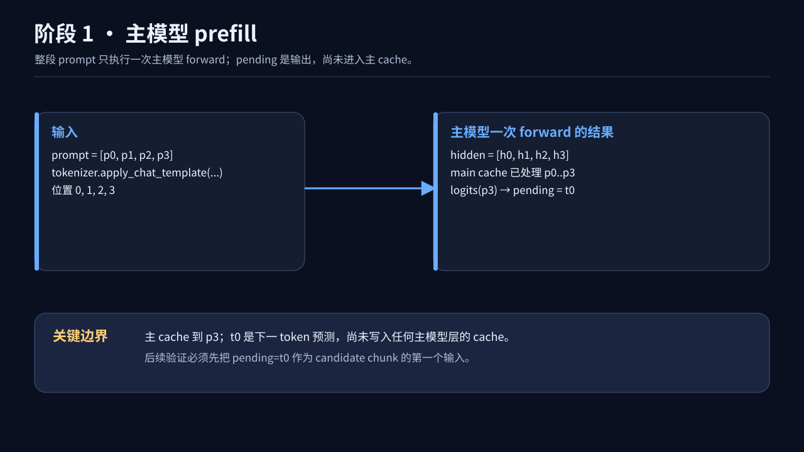
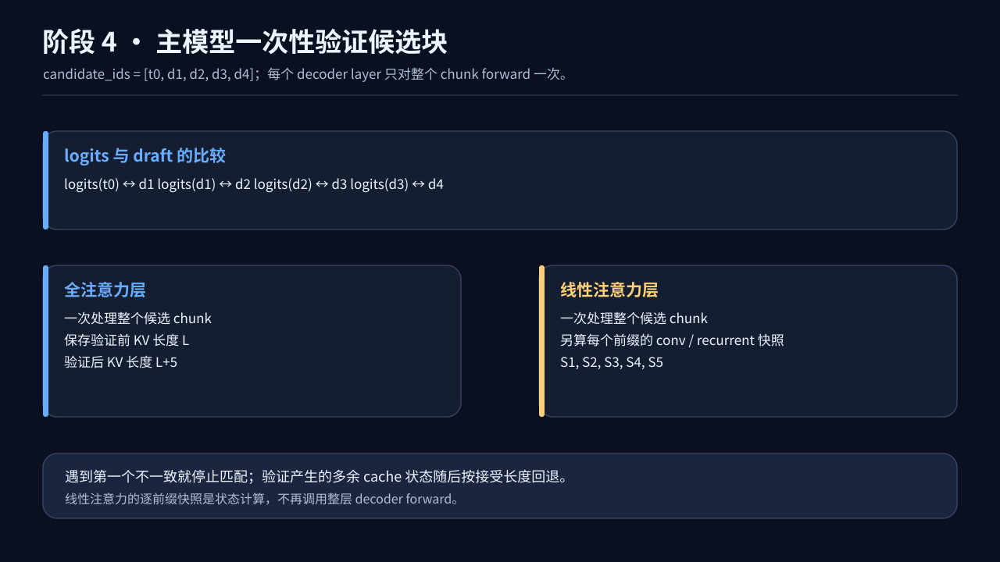
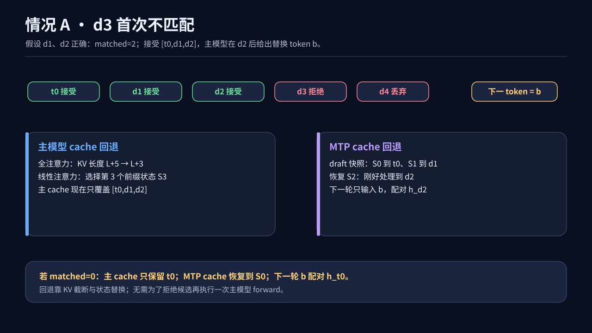
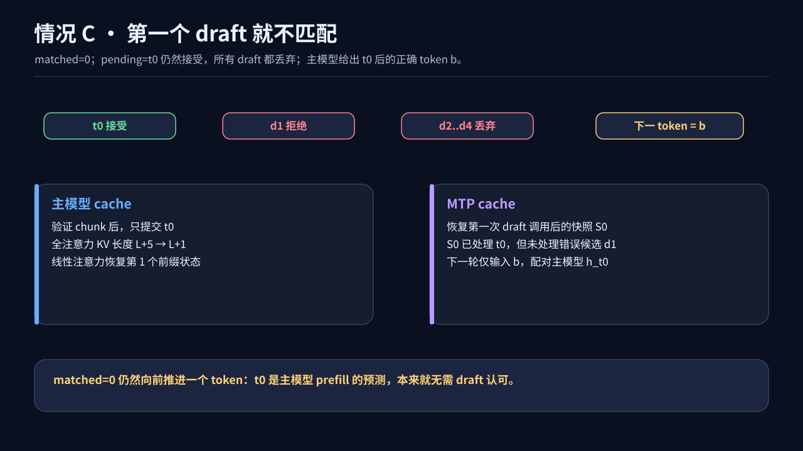

# Qwen3.5 MTP 推理流程图

图中 `t0` 是主模型 prefill 后预测的 token，`d1` 至 `d4` 是 MTP 提出的四个候选，`b` 是主模型在验证后给出的下一 token。`h_x` 表示主模型处理 token `x` 后的 hidden state。

## 总览

## 1. 主模型 prefill

## 2. MTP prefill

## 3. 连续生成候选

## 4. 主模型验证

## 情况 A：部分候选被接受

## 情况 B：全部候选被接受

## 情况 C：第一个候选就不匹配

## 两类 Attention Cache 的回退对比

这些图对应 [简洁版代码](demo_qwen3_5.py) 和 [注释版代码](demo_qwen3_5_annotated.py)。
