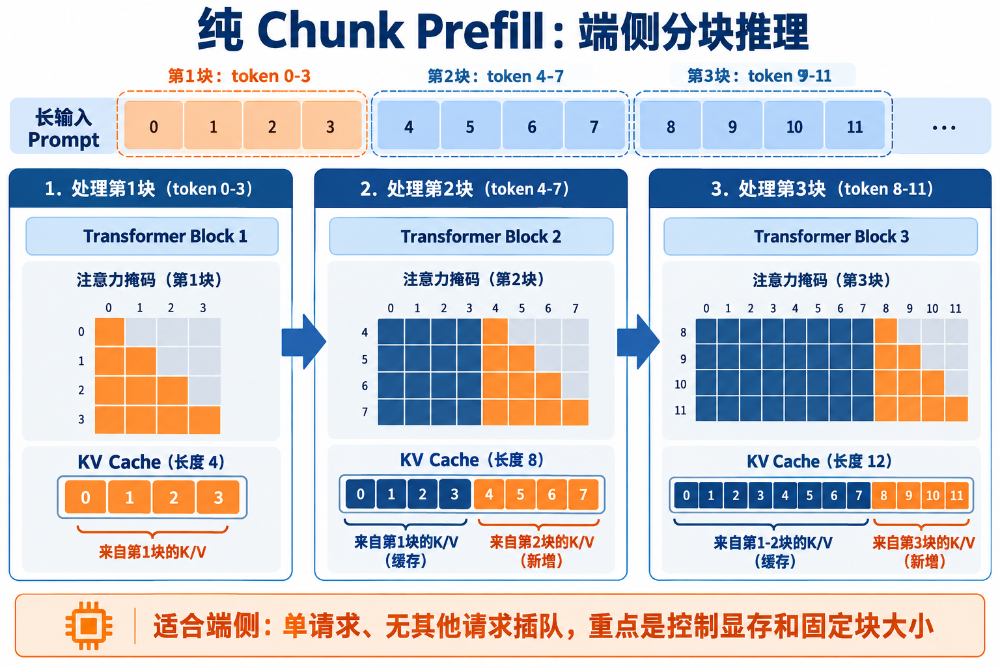
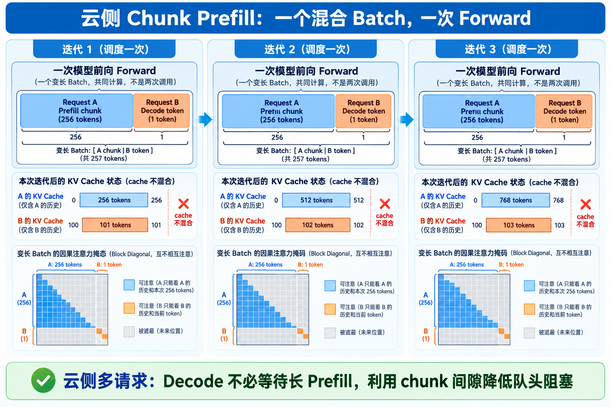

# Chunk Prefill 到底在做什么？用一个几十行的 PyTorch Demo 看懂

很多人第一次看到 Chunk Prefill，会以为它是一个更快的 Transformer。其实它做的事情很朴素：**把一段很长的输入拆成几小段，分批送进模型，同时维护好 KV Cache**。

这篇文章不加载任何大模型，只用一个很小的 PyTorch 因果注意力模型演示两个过程：

1. 只做 Chunk Prefill，并验证它和一次性 Prefill 的结果一致；
2. 模拟一个请求正在长 Prefill，另一个请求穿插 Decode。

完整代码在 [`demo_chunk_prefill.py`](demo_chunk_prefill.py)。

## 先说为什么需要 Chunk Prefill

假设一个请求带着 16,384 个 token 的长提示词进来。最直接的做法是把这些 token 一次性送进模型，算完后才开始生成。

这通常有不错的矩阵计算效率，但它会长时间占用 GPU。此时如果另一个请求已经在生成阶段，它只能排队等待。某些推理系统还需要固定大小的输入块来配合静态图，整段长输入也不方便直接执行。

Chunk Prefill 的思路就是把输入切成固定大小的小块，例如：

```text
16,384 tokens
        ↓ 切成每块 2,048 个 token
[chunk 0] → [chunk 1] → [chunk 2] → ... → [chunk 7]
```

每个 chunk 依次计算，前一个 chunk 产生的 KV Cache 会交给下一个 chunk。这样总的模型计算仍然要做完，但 GPU 可以在 chunk 之间安排别的请求。


## 在看代码前，先搞懂 KV Cache

自回归生成时，模型每次只新增一个 token。如果每次都重新计算整段历史，前面已经算过的内容会被反复计算。

注意力层会把历史 token 变成 Key 和 Value。KV Cache 就是把这些结果保存下来：下一次只计算新 token 的 Q、K、V，再用新的 Q 去读取历史 K、V。

```text
第一次：prompt → 计算并保存 K/V，cache 长度 = prompt 长度
下一次：新 token → 读取历史 K/V，只追加 1 个 K/V
```


这里需要记住一个细节：**每个请求都有自己的 cache**。请求 A 的历史不能和请求 B 的历史拼在一起，否则注意力就会读到别人的内容。

## Demo 1：纯 Chunk Prefill，适合端侧单请求

端侧通常面对的是一个正在交互的请求：设备上没有很多请求需要抢占 GPU，重点是把长输入分成固定块，控制峰值显存，并让每一块都能用同一套计算图执行。



### 这一步到底怎么切

假设输入有 12 个 token，chunk size 是 4：

```text
第 1 块：token 0、1、2、3
第 2 块：token 4、5、6、7
第 3 块：token 8、9、10、11
```

第 1 块没有历史 cache，只能在块内使用因果注意力；第 2 块计算时，注意力的 Key、Value 由两部分组成：第 1 块已经保存的 K/V，以及第 2 块刚计算出的 K/V。第 3 块继续读取前两块的 cache，再追加自己的 K/V。

对应的 mask 不是把每个 chunk 当成互不相关的小句子，而是一个“左边全部可见、右边未来不可见”的矩阵。以第 2 块为例：

```text
                 可读的历史 cache       当前块内部       未来位置
query token 4    [ 0  1  2  3 ]          [ 4 ]          [mask]
query token 5    [ 0  1  2  3 ]          [ 4  5 ]        [mask]
query token 6    [ 0  1  2  3 ]          [ 4  5  6 ]      [mask]
query token 7    [ 0  1  2  3 ]          [ 4  5  6  7 ]    [mask]
```

所以，token 6 能看到 0～6，但看不到 token 7；这和一次性 Prefill 的因果 mask 完全相同。所谓“分块”，只是把这个大矩阵按时间分段执行，并没有改变可见性规则。

### Demo 1：分块 Prefill 和一次性 Prefill 结果一样

代码中的 `TinyCausalLM` 只有一个注意力层。它的 `forward` 接收三个东西：

```python
logits, key, value = model(input_ids, past_key, past_value)
```

`past_key` 和 `past_value` 就是之前的缓存。首次调用时没有 cache；后续调用会把历史 K/V 和当前 chunk 的 K/V 拼起来。

`prefill_in_chunks` 的核心逻辑很简单：

```python
for start in range(0, input_ids.shape[1], chunk_size):
    chunk = input_ids[:, start : start + chunk_size]
    logits, key, value = model(chunk, key, value)
```

以 12 个 token、chunk size 为 4 为例，cache 长度会这样增长：

```text
第 1 块 [0:4]   cache length = 4
第 2 块 [4:8]   cache length = 8
第 3 块 [8:12]  cache length = 12
```

为什么结果应该和一次性 Prefill 一样？因为第 2 块计算时仍然能看到第 1 块的全部 K/V，第 3 块也能看到前两块；同时因果 mask 保证当前位置不会偷看未来 token。于是每个位置看到的历史和一次性计算完全相同。

脚本会把两种方式的 logits、最终 K 和最终 V 做比较，输出类似：

```text
max logits difference: 5.96e-08
same final K: True same final V: True
```

这个微小差异来自浮点计算顺序，不是算法结果不同。

## Demo 2：Prefill 和 Decode 混合调度，适合云侧多请求

云侧服务通常同时处理很多请求。此时一个长输入不能长时间独占 GPU，否则已经在生成的请求会被挡住。混合调度把长请求 A 的 Prefill chunk 和请求 B 的 Decode 交错执行：



真正的服务通常不会只处理一个请求。下面的例子有两个请求：

- 请求 A：有 12 个 token，需要做长 Prefill；
- 请求 B：已经完成初始 Prefill，正在逐 token Decode。

调度器每处理完 A 的一个 chunk，就让 B Decode 一个 token：

```text
A prefill chunk 0 → B decode 1 token
A prefill chunk 1 → B decode 1 token
A prefill chunk 2 → B decode 1 token
```

两条请求各自维护独立的 cache：

```text
A cache: [A 的 token 0 ... A 的 token 11]
B cache: [B 的历史 token ... B 新生成的 token]
```

当 B Decode 一次时，它只把自己的新 token 追加到 B 的 cache；A 的 cache 不会被修改。反过来，A 继续 Prefill 时也只更新 A 的 cache。

代码里的 `forward_mixed` 会在一次模型调用中接收 `[A 的 chunk, B 的 1 个 token]`，然后用变长、块状的注意力 mask 分别计算两个请求。它不是先调用 A 再调用 B，而是模拟 vLLM 的“一个迭代对应一次混合前向”。真实推理引擎还会把更多请求的 token 拼进同一个 varlen batch，并根据 `max_num_batched_tokens` 控制本轮总 token 数。

### GPU 上是怎么把它们放进一次前向的

这里的“拼成一个 batch”不是把 A 和 B 当成一条普通连续句子，让 B 看到 A 的 token。实际 GPU 实现通常使用 FlashAttention 的 varlen（变长序列）接口：

```text
packed Q/K/V = [A 的 chunk token][B 的 decode token]
cu_seqlens  = [0, len(A), len(A) + len(B)]
```

`cu_seqlens` 告诉 CUDA kernel，每个请求在 packed 张量中的起止位置。FlashAttention 根据这些边界分别读取 A、B 的 KV Cache，并在 kernel 内应用各自的因果注意力规则。逻辑上等价于一个 block-diagonal 的注意力矩阵：

```text
             A 的 token       B 的 token
A 的 query   可以注意 A       全部 mask
B 的 query   全部 mask        可以注意 B
```

因此，A 的 256 个 Prefill token 和 B 的 1 个 Decode token 可以在同一次 FlashAttention 调用中完成；它们共享 GPU 的矩阵计算和 kernel 调度，但不会共享上下文。Decode 仍然只读取 B 的历史 KV Cache，Prefill 则读取 A 的历史 KV Cache 并追加当前 chunk 的 K/V。

不同推理引擎的 batch 元数据名称可能不同，但核心都是三件事：把 token 打包、记录每条序列的边界、在注意力 kernel 中保持序列隔离。本文的 `forward_mixed` 用 Python 循环模拟了这种隔离逻辑，真实服务会把相同的边界信息交给 FlashAttention CUDA kernel 执行。

### 混合场景里的 mask 怎么分布

请求 A 和请求 B 的 mask 是两套独立的 mask，不能把两个请求的 token 拼到同一条历史里。A 的一个 chunk 只读取 A 的历史 cache 和 A 当前 chunk 的左侧位置；B 的 Decode 只读取 B 的全部历史 cache 和当前生成位置。两者的可见范围分别是：

```text
A 的 chunk：A 历史 cache + A 当前 chunk 的过去位置，A 未来位置 mask
B 的 decode：B 历史 cache + 当前 B token，其他位置不存在
```

因此混合调度改变的是“谁先占用计算资源”，不会改变单个请求内部的注意力顺序。只要 cache 和 mask 管理正确，A 分三块算、B 穿插生成，结果仍然等价于分别完成 A 的 Prefill 和 B 的 Decode。

## Chunk size 不是越大越好

chunk 太大，单次计算更接近普通 Prefill，GPU 可能被一个长请求占用更久；chunk 太小，调度更灵活，但 kernel launch 和 Python 调度次数会增加。

所以 Chunk Prefill 主要带来的是**调度和延迟控制能力**，不是凭空减少总 FLOPs。实际系统通常会根据显存、静态图要求、请求长度和并发量选择 chunk size。

## 运行方式

不需要下载模型，也不依赖 Transformers：

```bash
python demo_chunk_prefill.py
```

看这个示例时，可以重点观察两点：

1. chunk 之间 cache 长度持续增加；
2. A 和 B 的 cache 始终独立，但调度顺序可以交错。

这就是 Chunk Prefill 的核心：**把长 Prefill 拆开执行，让系统有机会在块与块之间服务 Decode，同时保持和一次性 Prefill 相同的因果注意力结果。**
