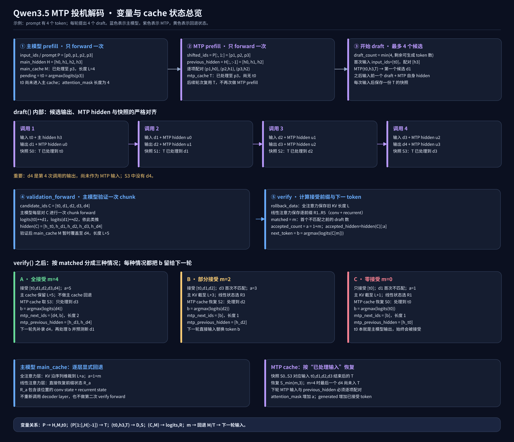
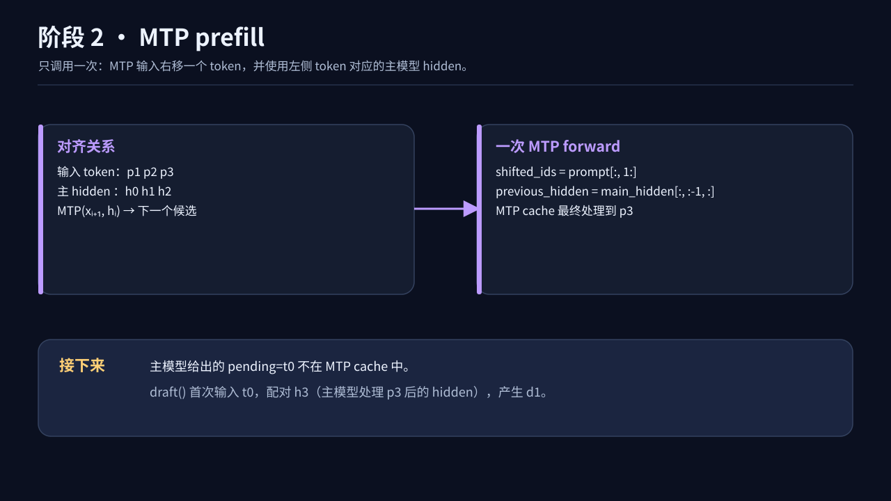
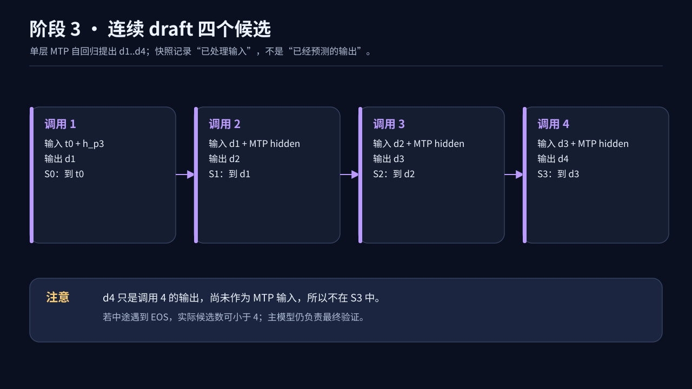
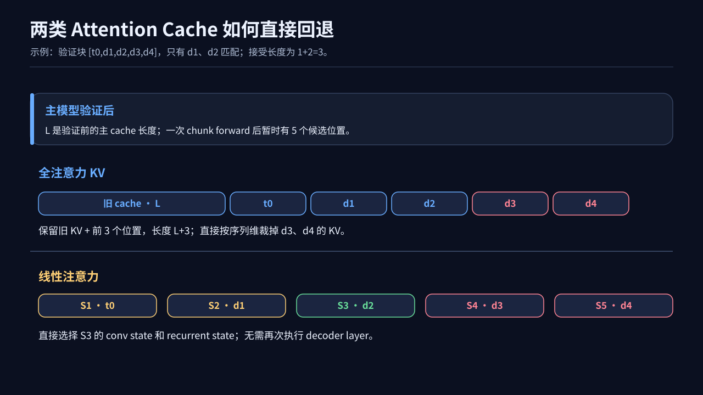
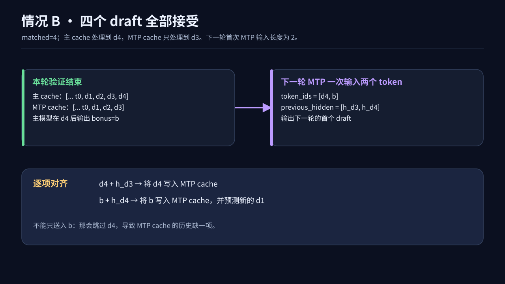

# 端侧给 Qwen3.5 接上 MTP：四个草稿 Token，最难的却是 Cache 回退

## 为什么我要研究这件事

最近在做端侧部署，需要给推理链路加上 MTP 功能。端侧最在意的往往是用户等下一个字时的延迟，但可用的算力、内存又没有服务器那么宽裕。我想弄明白：MTP 到底怎样减少主模型的解码轮数？如果猜错了，两套 cache 怎么安全地退回去？

起初我觉得流程很简单：小模块先猜几个 token，大模型一次检查。真正把代码写到 Qwen3.5 上才发现，最容易出错的是“猜错后怎么还原状态”。它的主模型混用了全注意力和线性注意力，两种 cache 根本不是一种存法。

这篇文章先不碰实现细节，讲清楚投机解码在做什么、为什么有机会加速；再拿 Qwen3.5-0.8B 的 demo，把 prefill、draft、verify 和每一层 cache 回退拆开。demo 使用单条输入和贪心解码，目的是观察状态变化，不代表已经完成端侧性能优化。

## 先不看代码：投机解码是怎样走的一轮？

平时让主模型续写，它一次只知道下一个 token。想再写一个，得先等上一个算出来，再把它喂回去。连续写五个，主模型就得串行跑好几轮。

投机解码多了一个“先打草稿的人”。假设主模型已经给出待处理的 token `t0`，MTP 接着猜出 `d1、d2、d3、d4`。主模型把 `[t0,d1,d2,d3,d4]` 当成一段**已知输入**，一次 forward 检查：它读完 `t0` 会不会也选 `d1`？读完 `d1` 会不会选 `d2`？从左到右，碰到第一个不一致就停。这里讲的是这份 demo 的贪心验证；如果用采样，还需要相应的接受与拒绝规则。

拿三种结果感受一下：

- `d1` 就猜错：只接受主模型自己给的 `t0`；主模型给出正确的下一 token `b`。
- `d1、d2` 对，`d3` 错：接受 `[t0,d1,d2]`；把主模型在 `d2` 后选的 `b` 留给下一轮。
- 四个都对：接受 `[t0,d1,d2,d3,d4]`；主模型还会给出 `d4` 后的下一个 token `b`。

MTP 有点像提前写好四道题的答案，主模型是阅卷的人。阅卷可以一次看一页，但只要中间有一道错了，后面依赖它的答案就不能直接采用。接下来最关键的问题是：这一次“看一页”，为什么可能比主模型自己一题一题做快？

## 为什么投机解码可能加速？

从同一个起点看：`t0` 已预测、但还没进入 cache。普通路线要把主 cache 推过 `t0` 到 `d4`，并得到下一 token `b`，必须连续做 5 次主模型 decode；**验证 5 个已知候选**时，`[t0,d1,d2,d3,d4]` 已由 MTP 准备好，主模型可以加因果 mask，一次 forward 算出五个位置的预测。

但“一次调用”本身不等于“一样快”。真正能省时间，是因为单用户、小 batch 的逐 token decode 往往在等**模型权重从显存读进计算单元**。以某层线性投影为例，输入 1 个 token 时近似是矩阵乘向量：权重读一遍，只做一行输出。输入 5 个已知 token 时更像矩阵乘一个 5 行的小矩阵：还是要读这份权重，但它能在同一次算子里服务五行输入。计算量确实增加了，权重读取和部分固定开销却被摊到了五个 token 上。[NVIDIA 的推理说明](https://developer.nvidia.com/blog/mastering-llm-techniques-inference-optimization/)也把小 batch decode 描述为更容易受内存传输限制的矩阵向量计算；[原始投机采样论文](https://arxiv.org/abs/2302.01318)提出的正是“短候选段的并行打分耗时可接近单 token 打分”这个观察。

拿一个**纯粹为了说明原理**的数字来说：假设目标模型逐 token 一次需要 10 毫秒，验证 5 个已知输入需要 14 毫秒，MTP 连猜 4 个总共需要 4 毫秒。如果这 4 个草稿全对，这轮确认 `[t0,d1,d2,d3,d4]`，主 cache 也走到 `d4`，并算出下一待处理 token `b`；要达到相同的 cache 进度，普通路径需要连续 5 次主模型 decode，约 50 毫秒，这里是 18 毫秒。若 `d1` 就错了，这轮只确认 `t0`，18 毫秒反而比普通路径的一次 decode（10 毫秒）慢。数字是假设，真实结果要看接受率与实测延迟。

所以对“是不是 L1/L2 cache，或者 MMA 的零填充？”我的理解是：**都可能影响具体数值，但通常不是主要解释。** GPU 上权重是否命中 L2、算子是否把几行输入放进同一个 tile、tile 有没有空位，都会让 1 行到 5 行的时间曲线出现平台或台阶；甚至两种长度可能走不同的 kernel，不能笼统说“反正都 padding 到同一个 MMA tile”。[NVIDIA 的矩阵乘性能指南](https://docs.nvidia.com/deeplearning/performance/pdf/Matrix-Multiplication-Background-User-Guide.pdf)确实讨论了 tile 尺寸造成的量化效应。更稳妥的解释是：**短 chunk 在不少场景中增加了计算，却没有按 token 数等比例增加权重搬运时间**。上下文很长、并发高、权重已充分驻留缓存、端侧设备算力紧张，或线性注意力状态保存实现太重时，验证 5 个 token 就可能明显慢于验证 1 个。

## 写代码前，先弄清两种 Attention 为什么要 Cache

这里的 **attention cache 是模型保存的历史状态**，和刚才提到的 GPU L1/L2 硬件缓存不是一回事。想象提示词已经读完，现在又来了一个 token：如果什么都不存，模型每生成一步都得把前面的内容重新处理一遍。Cache 的目的就是把“下次还要用的历史计算结果”留下来。[Transformers 的缓存说明](https://huggingface.co/docs/transformers/cache_explanation)对 KV cache 的作用有更完整的介绍。

**先看全注意力。** 新 token 会产生自己的 Query、Key、Value。可以把 Query 当成它这次想问的问题，过去 token 的 Key 用来判断该看谁，Value 则提供要读取的内容。比如历史是 `[A,B,C]`，现在处理 `D`，`D` 的 Query 需要和 `A、B、C、D` 的 Key 计算关系，再从对应的 Value 取信息。

下一次处理 `E` 时，`A、B、C、D` 的 Key 和 Value 还会被用到。因此每个全注意力层都保存历史 **K/V**，新 token 只追加自己的 K/V。过去的 Query 已经完成了它当时的提问，下一步不会拿来给新 token 查询，所以通常不用缓存旧 Query。代价是：上下文越长，K/V 占的内存越多；即使不重算旧 token，新 Query 仍要读取历史 K/V。

**再看 Qwen3.5 的线性注意力层。** 它走的是 Gated DeltaNet 路径，不能简单理解成“把全注意力的 K/V 换个格式存起来”。这一层会把读过的 token 逐步折进一个 `recurrent_state`：新 token 来了，就在旧状态上做衰减、读取和修正。与此同时，Q/K/V 的投影还经过因果卷积，下一步需要最近几个输入，所以还要保存一个短窗口 `conv_state`。这两种状态在 [Qwen3.5 的实现](https://github.com/huggingface/transformers/blob/main/src/transformers/models/qwen3_5/modeling_qwen3_5.py)中分别更新。若不保存它们，下一个 token 想接着算，就得重新扫描前面的序列。

两种存法的差别，可以先记成这张小表：

| 层类型 | 下一个 token 还需要什么历史 | Cache 里保存什么 | 长度增加时 |
| --- | --- | --- | --- |
| 全注意力 | 与所有历史 token 的 K/V 交互 | 按位置排列的 K/V | K/V 随上下文增长 |
| 线性注意力 | 从压缩后的状态继续更新，还要做最近位置的卷积 | `recurrent_state` + `conv_state` | 这两份状态的大小不随上下文线性增长 |

拿“猜错了要退回 `D`”这件事想一想：全注意力的 K/V 是按位置排好的，尾部截掉就行；线性注意力的状态已经被后面的 token 改写，不能只改一个长度数字。这正是后面代码要为每层分别保存回退点的原因。

## 回到 Qwen3.5：把这一轮落到代码里

上面是投机解码的通用想法。下面才进入这份 Qwen3.5 demo：哪些变量在主模型里，哪些在 MTP 里，哪个 token 已经写进 cache，哪个还只是刚预测出来。




## 先说模型里到底有几份 Cache

我用的这份 0.8B checkpoint，文本主模型共有 24 层：18 层 `linear_attention`、6 层 `full_attention`；配置里还有 `mtp_num_hidden_layers=1`、`mtp_use_dedicated_embeddings=false`。换句话说，主模型是两种注意力混合的，MTP 模块只有一层，并且复用词嵌入和输出头。Qwen3.5 的混合注意力结构也可以在 [Transformers 的模型文档](https://huggingface.co/docs/transformers/model_doc/qwen3_5)里看到。

所以至少要把两套东西分开想：

- **主模型 cache**：正式生成的历史。全注意力层保存 K/V；线性注意力层保存卷积状态和递归状态。
- **MTP cache**：草稿模型自己已经处理过哪些 token。它跟主模型 cache 不是同一份东西，回退位置也未必相同。

下面拿四个 prompt token 举例，记作 `p0、p1、p2、p3`。主模型处理完它们，得到 `h0、h1、h2、h3` 四个 hidden state，同时预测出下一个 token `t0`。

这里先停一下：**`t0` 只是预测结果，还没作为输入走过主模型，所以主 cache 只到 `p3`。** 这个边界一旦弄错，后面的 MTP 对齐和 cache 长度都会差一位。

## 两次 Prefill，各做一次就够了

主模型 prefill 很容易理解：整段 prompt 做一次 forward，拿到所有 hidden state、主 cache 和 `t0`。

代码里的入口差不多就是这样；`prefill_mtp()` 放在主模型 prefill 之后，而且整个生成过程中只调用一次：

```python
pending, main_hidden, main_cache = prefill(model, inputs)
mtp_cache = LayerwiseCache(mtp.config.layer_types, mtp=True)
prefill_mtp(mtp, inputs["input_ids"], main_hidden, mtp_cache)
mtp_next_ids = pending
mtp_previous_hidden = main_hidden[:, -1:, :]
```

这里先略去“已经遇到 EOS 或生成长度已用完”的早停分支；它们在完整 demo 中有判断。

MTP 的 prefill 稍微绕一点。它吃的是“右移一位”的 token 和“左边那个 token”的主模型 hidden：

```text
MTP 输入 token： p1     p2     p3
配对的主 hidden：h0     h1     h2
```

这一次调用过后，**MTP cache 已经处理到 `p3`，但还没有处理 `t0`**。接下来进入 draft，首次把 `t0` 和 `h3` 配在一起，才会预测出第一个候选 `d1`。

当时我也想过：“后面每轮是不是要再做一次 MTP prefill？”其实不用。MTP cache 会一直延续，只有最开始需要用 prompt 建立一次状态。后面每轮只喂新 token。



## 四个草稿是怎么来的？

这份 checkpoint 的 MTP 只有一层。我们希望一次最多投机四个 token，于是让它自回归地连续预测：

`draft()` 的第一步负责处理当前输入，后面的循环才把上一个候选重新喂进去。每次调用后保存 MTP cache 快照：

```python
first_token, first_hidden = mtp(input_ids, previous_hidden, mtp_cache)
drafted = [first_token]
cache_states = [mtp_cache.snapshot()]
token, hidden = first_token, first_hidden
while len(drafted) < count:
    token, hidden = mtp(token, hidden, mtp_cache)
    drafted.append(token)
    cache_states.append(mtp_cache.snapshot())
```

这里省略了代码中对 EOS 的判断，方便先盯住 cache 的变化。对这个 demo 来说，`count` 最大是 4。

| MTP 调用 | 本次输入 | 本次输出 | 调用结束后的 MTP cache |
| --- | --- | --- | --- |
| 1 | `t0 + h3` | `d1` | `S0`：处理到 `t0` |
| 2 | `d1 + u0` | `d2` | `S1`：处理到 `d1` |
| 3 | `d2 + u1` | `d3` | `S2`：处理到 `d2` |
| 4 | `d3 + u2` | `d4` | `S3`：处理到 `d3` |

`u0、u1、u2` 是 MTP 自己上一步输出的 hidden。第一步有主模型的 `h3`，后面预测更多 token 时，就沿用 MTP 自己的状态。主模型稍后会验证这些猜测。

这张表有个特别容易看岔的地方：**输出 `d4`，不等于 `d4` 已经进入 MTP cache。** Cache 记录的是“本次喂进去并处理过的输入”；第四次喂进去的是 `d3`，因此快照 `S3` 只到 `d3`。



## 主模型只验证一次，怎么知道哪几个猜对了？

把 `t0、d1、d2、d3、d4` 拼成一个 chunk，送给主模型。主模型各层都对这一整段做一次 forward，得到每个位置的 logits。比较关系是：

```python
candidate_ids = torch.cat([pending, drafted], dim=1)
hidden, logits, rollback_data = validation_forward(model, candidate_ids, main_cache)
proposed = logits[:, :-1, :].argmax(dim=-1)
```

`validation_forward()` 手动遍历主模型的 decoder layer；每层只对整个 `candidate_ids` 做一次 chunk forward。`rollback_data` 则记下稍后恢复各层 cache 所需的信息。

```text
主模型读完 t0 的预测  ↔  d1
主模型读完 d1 的预测  ↔  d2
主模型读完 d2 的预测  ↔  d3
主模型读完 d3 的预测  ↔  d4
```

从左向右比，遇到第一个不一致就停。假设 `d1、d2` 都对，`d3` 错了，那么 `matched=2`。正式接受的是 `[t0,d1,d2]`，主模型在 `d2` 位置预测出的正确 token 记作 `b`，留给下一轮。

这里 `t0` 不参与“草稿猜对几个”的统计。它本来就是主模型在 prefill 时给出的预测，所以哪怕 `d1` 马上猜错，`t0` 仍然会被接受。

到这一步，看起来投机解码已经完成了。但主模型刚才为了验证，**实际上把整个 `[t0,d1,d2,d3,d4]` 都跑进了 cache**。如果把错的 `d3、d4` 留在里面，下一轮就会接着错误的上下文生成。现在必须回退。

## 全注意力的回退：截掉多出来的 K/V

先看相对简单的情况。假设验证前全注意力层的 KV 长度为 `L`，验证五个 token 后变为 `L+5`。前面那个例子只接受了 `t0、d1、d2`，也就是 `accepted_count=1+matched=3`，所以直接把每层 K/V 截到 `L+3`。

全接受时就不用截；一个 draft 都没接受时只保留 `t0`，截到 `L+1`。这一层的历史按 token 排列，截掉尾巴就能回到接受点。

代码里，全注意力层的回退信息只需记验证前长度 `L`；拒绝发生时，恢复长度就是 `L + accepted_count`。不需要为每个候选复制整份 K/V。

## 线性注意力的回退：不能把最终状态“截短”

线性注意力完全不是这回事。Qwen3.5 这条路径里至少有两份要续用的状态：

1. **卷积状态 `conv_state`**：最近一小段投影后的 Q/K/V 输入。下一个 token 的因果卷积会用到它。
2. **递归状态 `recurrent_state`**：已经读过的 token 经 Gated DeltaNet 更新后留下的摘要。下一步的计算从这份摘要继续。

可以把 `recurrent_state` 想成一张不断改写的草稿纸。读完 `d4` 后，纸上只剩最终版本；你不能像切 K/V 那样，在末尾剪两刀就得到“刚读完 `d2`”时的内容。卷积状态同样要恢复到 `d2` 对应的窗口。

具体一点，卷积状态保存最近 `conv_kernel_size` 个位置的投影输入；递归状态按每个 token 的 `k、v、g、β` 更新。忽略 head 维度和归一化细节，直观上是下面这样：

```text
state = exp(g) * state                 # 旧信息衰减
pred  = kᵀ * state                    # 用当前 key 读出预测
state = state + β * k * (v - pred)ᵀ  # 写入本 token 的修正
```

所以只拿到处理完 `d4` 的 `state`，一般没法便宜地“倒算”回处理完 `d2` 的状态。代码里对应的更新路径可见 [Qwen3.5 线性注意力实现](https://github.com/huggingface/transformers/blob/main/src/transformers/models/qwen3_5/modeling_qwen3_5.py)。

我在 demo 里采用的办法是：主模型仍然对整段候选做 **一次 chunk forward**，同时针对每个线性注意力层，保存“处理到第几个候选”时的内部状态。以五个输入为例，记作 `R1` 到 `R5`：

```text
R1：处理完 t0       R2：处理完 d1       R3：处理完 d2
R4：处理完 d3       R5：处理完 d4
```

如果接受三个输入，就把该层的 `conv_state` 和 `recurrent_state` 直接换成 `R3`。这就是“用 cache 替换回去”，不需要为了回退再执行一遍完整的 decoder layer。

在 `verify()` 里，两类层最终汇到同一个逐层恢复循环。全注意力传要保留的长度，线性注意力传第 `accepted_count` 个位置的状态：

```python
accepted_count = 1 + matched
if matched < drafted.shape[1]:
    restore_states = []
    for layer_type, state in zip(main_cache.layer_types, rollback_data):
        if layer_type == "full_attention":
            restore_states.append((state + accepted_count, None, None))
        else:
            restore_states.append(state[accepted_count - 1])
    main_cache.restore(restore_states)
```

`main_cache.restore()` 再逐层裁剪 K/V，或替换该层的 `conv_state`、`recurrent_state`。这段发生在候选不全匹配时；全匹配就直接保留验证后的主 cache。

保存快照时还有个很实际的小坑：**要保存独立副本，不能只记住原张量的引用。** 单 token 解码用到的卷积更新可能原地修改 cache；若几个“快照”共享同一块存储，最后看到的都会是新状态。相比之下，全注意力层只需记住验证前的 KV 长度，不必为每个候选复制整份历史 KV。

这些中间状态从该层**经过 input layernorm 的输入**计算出来。随后对每个 token 更新卷积窗口和递归状态，并保存快照。这里容易踩坑：若直接拿未经该层归一化的 hidden 去推状态，算出来的 `R3` 就不是该层真实会得到的 `R3`。另外，这一步虽省掉了第二次完整的主模型 forward，仍有额外的逐前缀状态计算和存储开销。



## 主 cache 退好了，MTP cache 还要单独退

继续用 `d1、d2` 正确、`d3` 错误的例子。主模型 cache 回到 `d2`；MTP cache 则恢复到上面表格里的 `S2`，它也正好处理到 `d2`。下一轮只要把主模型给出的正确 token `b` 喂给 MTP，配对主模型读完 `d2` 的 hidden `h_d2`。

如果更倒霉，`d1` 就猜错，`matched=0`：主模型仍保留 `t0`，全注意力 KV 留到 `L+1`，线性注意力选 `R1`；MTP 恢复 `S0`，下一轮把正确 token `b` 和 `h_t0` 配对。这里没有“一个 token 都没生成”，因为 `t0` 是主模型自己给的。

如果四个草稿全对，事情反而更有意思。主模型 cache 已处理到 `d4`，MTP cache 却只处理到 `d3`，因为 `d4` 始终只是最后一次 MTP 调用的**输出**。主模型还会在 `d4` 后预测出 `b`。下一轮 MTP 要一次输入 `[d4,b]`，配对 `[h_d3,h_d4]`：先补上 `d4`，再处理 `b`。只输入 `b` 会让 MTP 的历史漏掉一个 token。

这也回答了一个一开始看着很反常的问题：**为什么下一轮 `draft()` 的 `input_ids` 长度有时是 2？** 因为这时要补录上轮最后一个已接受、但还没进入 MTP cache 的候选。部分接受时，这一步已经在上轮的草稿过程中做过了，下一轮长度才是 1。

对应到代码，就是验证之后先恢复 MTP 快照，再准备下一轮输入：

```python
mtp_cache.restore(mtp_states[min(matched, drafted.shape[1] - 1)])
if matched == drafted.shape[1]:
    mtp_next_ids = torch.cat([drafted[:, -1:], next_token], dim=1)
    mtp_previous_hidden = accepted_hidden[:, -2:, :]
else:
    mtp_next_ids = next_token
    mtp_previous_hidden = accepted_hidden[:, -1:, :]
```



## 真正做端侧部署，还得算一笔账

MTP 并不保证一定更快。它省下的是主模型逐 token 解码的轮数，付出的是 MTP 自身的计算、一次较长的主模型验证，以及候选状态快照的开销。候选越多，如果接受率不高，白做的计算也会越多。vLLM 的 [Qwen3.5 部署建议](https://github.com/vllm-project/recipes/blob/main/Qwen/Qwen3.5.md)同样把 MTP 放在偏低时延的场景，同时提醒它可能降低高并发下的吞吐；具体效果还是得在目标硬件和实际请求上测。

想分清自己的设备到底是“读权重慢”，还是“矩阵 tile 没填满”，最好别靠猜。固定上下文长度、预热后分别测 `k=1..8` 的主模型验证时间，再把 MTP draft、线性状态快照、cache 回退单独计时；有 profiler 的话再看 DRAM 读量、L2 命中率、矩阵算子利用率和实际选用的 kernel。若验证耗时随 `k` 缓慢增长，而算术量增长得更快，通常说明原先有内存或固定开销瓶颈；若跨某个 tile 边界突然跳一下，才值得具体分析 tile 量化。端侧 CPU、GPU、NPU 的结论可能不同。

我的 demo 还刻意保留了一个“教学版”的取舍：为了让线性注意力回退看得见，逐个前缀计算并保存状态。真做端侧实现时，更理想的是让验证 kernel 顺手暴露这些中间状态，减少重复投影、内存拷贝和 host 侧调度。还要测接受率、每输出 token 时延、峰值内存，并覆盖 EOS、短输出、不同 draft 长度等边界。

最后还有数值问题。BF16 下，整块验证与逐 token forward 的计算顺序不完全一样，可能出现舍入差异。所以“主模型验证通过”要以**这次实际验证的 logits**为准；不能只凭理论上的贪心等价就断言任何 kernel、任何精度下输出都逐 token 完全一致。

示例代码：[简洁版](https://github.com/mpj1234/qwen3_5-mtp-transformers/blob/main/demo_qwen3_5.py) · [注释版](https://github.com/mpj1234/qwen3_5-mtp-transformers/blob/main/demo_qwen3_5_annotated.py)。
